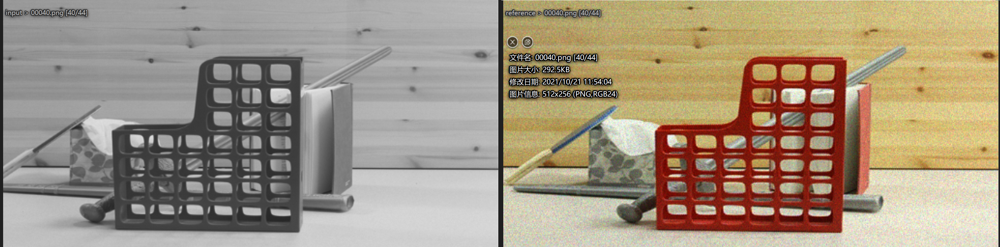
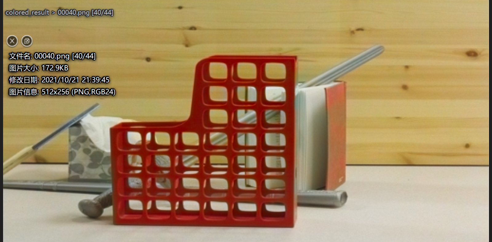

# Deep Exemplar-based Colorization

This is the implementation of paper [**Deep Exemplar-based Colorization**](https://arxiv.org/abs/1807.06587) by Mingming He*, [Dongdong Chen*](http://www.dongdongchen.bid/), [Jing Liao](https://liaojing.github.io/html/index.html), [Pedro V. Sander](http://www.cse.ust.hk/~psander/) and [Lu Yuan](http://www.lyuan.org/) in ACM Transactions on Graphics (SIGGRAPH 2018) 

官方代码 [windows + VS](https://github.com/msracver/Deep-Exemplar-based-Colorization)

第三方出了个 [linux docker](https://github.com/ncianeo/Deep-Exemplar-based-Colorization)

linux 上这版代码我用 docker 跑通了，但是，说实在的，docker 实在太难用了。**我只是把代码改成了我自己喜欢的方式**。

首先说下，最复杂的就是环境，我的是 caffe + cuda10.1 + opencv-4.5.2，只要这些环境正确，基本就可以，尤其是 cuda，坑爹。


```shell
cd demo
# 下载训练好的网络
sh download_weights.sh
# 编译前两个部分, deep_image_analogy + similarity_combo
sh make.sh
# 运行
sh run.sh
```


其中 run.sh 设置一些输入输出路径什么的，需要注意，INPUT_DIR 和 REFER_DIR 中的图片名字要一一对应，不然，自己去 ./src/linux/ 源码中去改。

```shell
# 输入的灰度图文件夹
INPUT_DIR="./example/middlebury/input"
# 参考的彩色图文件夹
REFER_DIR="./example/middlebury/reference"
# 上色的解雇哦保存到哪里
RESULT_DIR="./results/noise07/level1T/middlebury"

# deep_image_analogy
./bin/deep_image_analogy 	models/deep_image_analogy/	 ${INPUT_DIR}	 ${REFER_DIR} 	${RESULT_DIR}/flow
# similarity_combo
./bin/similarity_combo	 models/similarity_subnet/	 ${INPUT_DIR} ${REFER_DIR}	 ${RESULT_DIR}/flow 	${RESULT_DIR}/combo
# colorization
python3 ../colorization_subnet/test.py --input_dir ${INPUT_DIR} --refer_dir ${REFER_DIR} --combo_dir ${RESULT_DIR}/combo --out_dir ${RESULT_DIR}/colored_result  --short_size 256 --test_model models/colorization_subnet/example_net.pth --gpu_id 0
```


举个例子，两张存在视差的灰度图 + 彩色图，彩色图有大量噪声，二者的名字是一样的，路径不同。



上色的结果



很清楚，灰度图上色之后，效果还不错，同时去除了噪声。


搞这个环境花费了好多时间，以此做个纪念。 


